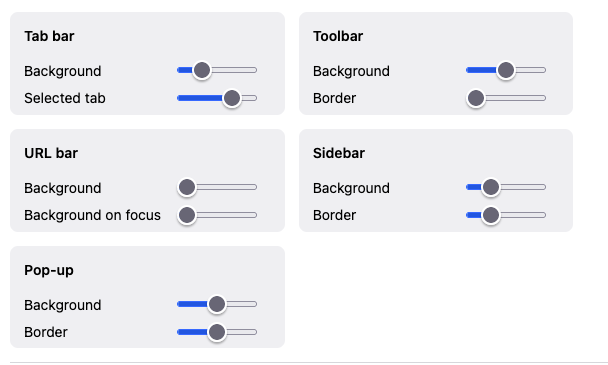
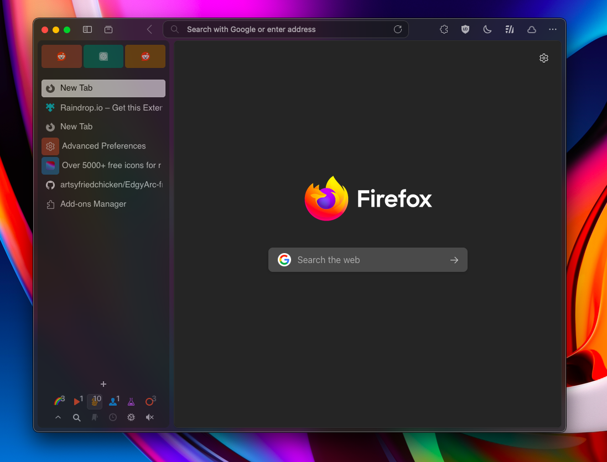
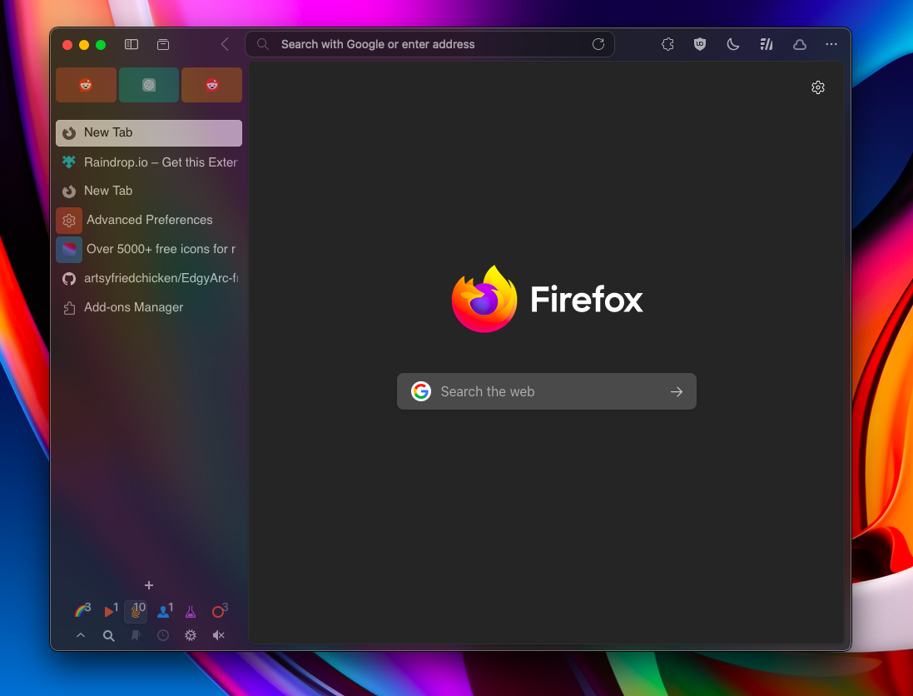
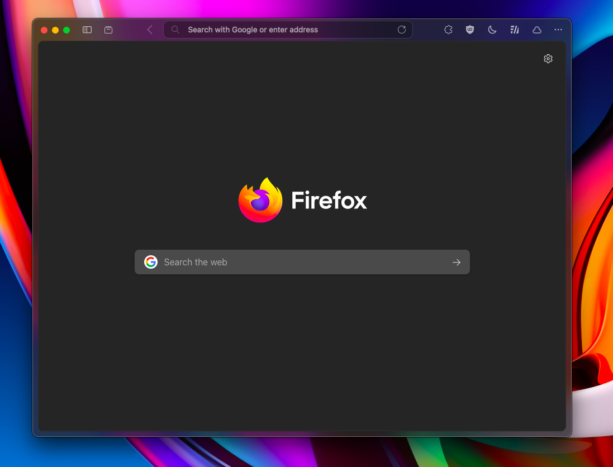
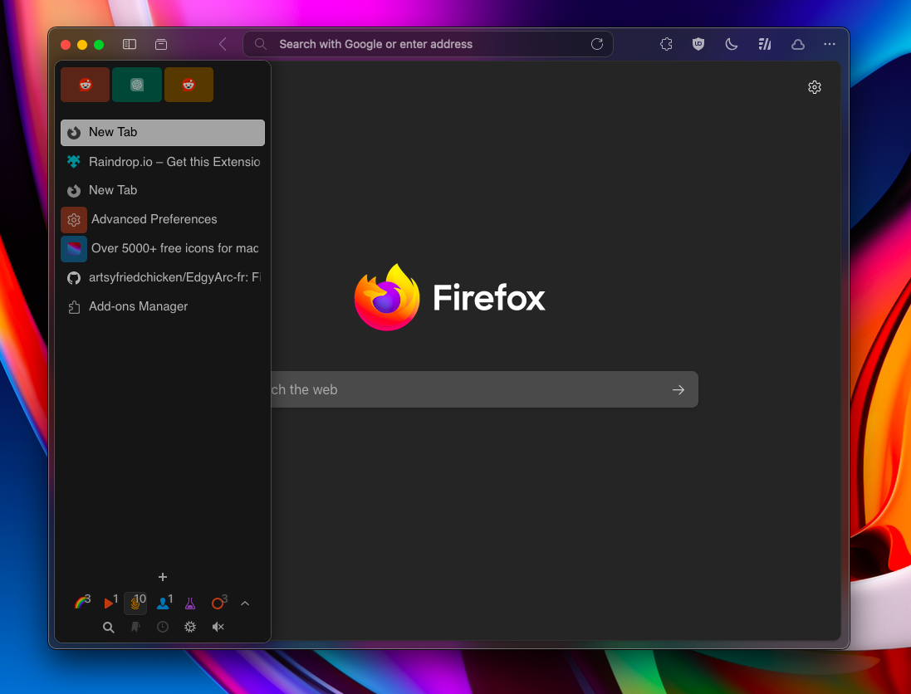

# EdgyArc-fr

Because Arc and Edge look pretty af but FOSS FTW

## Prerequisites

To use EdgyArc-fr to its fullest potential, ensure you have the following prerequisites:

- [EdgeFrFox UserChrome Theme](https://github.com/bmFtZQ/edge-frfox/) 
- [Sidebery](https://addons.mozilla.org/firefox/addon/sidebery/) 
- Recommended Addons:
  - [UserChrome Toggle](https://addons.mozilla.org/firefox/addon/userchrome-toggle/) 
  - [Adaptive Tab Bar Color](https://addons.mozilla.org/en-GB/firefox/addon/adaptive-tab-bar-colour/) 

## Whats Included

- Auto-collapse sidebar
- Auto-hide sidebar 
- Toggle sidebar show/collapse using [UserChrome Toggle](https://addons.mozilla.org/firefox/addon/userchrome-toggle/) 
- `macOS only` Translucent windows
- Custom Sidebery theme
  

## Usage
### Step 1 - Prerequisites

  
 Install recommended addons 

- [Sidebery](https://addons.mozilla.org/firefox/addon/sidebery/)
- [UserChrome Toggle](https://addons.mozilla.org/firefox/addon/userchrome-toggle/) `Required for sidebar autohide`
- [Adaptive Tab Bar Colour](https://addons.mozilla.org/en-GB/firefox/addon/adaptive-tab-bar-colour/)

  
 Install and Configure Base theme 

  
- Clone or download the [EdgeFrFox UserChrome Theme](https://github.com/bmFtZQ/edge-frfox/) repository to your local machine.
  - Copy the contents of the `chrome` folder into your Firefox profile's `chrome` folder.
- Enable/Add the following settings in `about:config` to enable features in EdgeFrFox
    Make sure to initialise all of these as Booleans

  `uc.tweak.hide-tabs-bar` to `true`

  `uc.tweak.hide-forward-button` to `true`

  `uc.tweak.rounded-corners` to `true`

  `uc.tweak.floating-tabs` to `true`
  
    Please make sure you also have the following perquisites set to `true` 

   `toolkit.legacyUserProfileCustomizations.stylesheets`

    `svg.context-properties.content.enabled`

  `layout.css.color-mix.enabled`

    `layout.css.light-dark.enabled`

    `layout.css.has-selector.enabled`
  
  

### Step 2 - Install and Configure EdgyArc 
#### Install
Copy the contents of `chrome` folder in this repository to your Firefox profile's `chrome` folder.

#### Configure
Before you start using the theme as-is, you might want to have a look at all the style variants built into EdgyArc-fr

  
View all Style Variants

  
#### Translucent Effects `macOS Only`
Transparency is enabled by default unless you have Reduce Transparency enabled in Accessability under System Settings
- Disable transparency using 
`uc.tweak.af.not-translucent` > `true` 

#### UI Tweaks
- Thin Nav bar 
`uc.tweak.af.thin-navbar` > `true`
- Turn all web extension icons greyscale when not hovered
  `uc.tweak.af.greyscale-webext-icons` > `true`
- Turn off sidebar dimming when translucency is disabled
  `uc.tweak.af.no-dimming` > `true`

#### Sidebar Tweaks
- Minimal (arc-like) sidebar 
`uc.tweak.af.translucent-arc` > `true` **[Recommended]**
- Show Sidebar Header
`uc.tweak.af.show-sidebar-header` > `true`
- Hidden Sidebar when collapsed (like in Arc)
`uc.tweak.af.hidden-sidebar` > `true`
- Sidebar Stays Collapsed on hover
`uc.tweak.af.sidebar-always-collapsed` > `true` > Stops sidebar from auto expanding when it is collapsed using ureschrome toggle
- Wider expanded sidebar
`uc.tweak.af.sidebar-width-350` > wider 350px sidebar when autohide is enabled (the default width is 260px)

### Step 3 - Import Sidebery configs
Import the following into sidebery  (`Sideberry Settings` > `Help` > `Import Addon Data`)
- `sidebery-styles.json` Contains the custom theme for Sidebery
Alternatively, you can copy the contents of `sidebery.css` into the custom styles tab in sidebery's settings.
- `sidebery-settings.json` Contains settings for the addon that **will** overwrite your own settings. you dont *have* to use this if you dont want to. 
**IF** you are not using `sidebery-settings.json` please make sure you have the sidebery navigation bar set to horizontal. (`Sidebery Settings` > `Navigation Bar` > `Layout` > `Horizontal` )

### Step 4 - Set up Adaptive Tab Bar Color settings

## Known Bugs
- `windows` Translucency / blur does not work on windows
- `windows` Margin issues in Windows 10
- `linux` Translucency / blur does not work out of the box
- `windows` `linux` `macos` Sidebar on right is misaligned
- `macos` browser window loses window shadow when moved to a different space

## Screenshots

## Changelog
- v1.0.0-b9
  - New
    - Added Thin navbar variant `uc.tweak.af.thin-navbar`
  - Fixed
    - Sidebery CSS (default background for pinned tabs)
    - Titlebar Controls positioning 
- v1.0.0-b8
  - Fixed
    - findbar background colour when using firefox color/adaptive tab bar color addons
    - tab notification deck translucency `macOS`
    - toolbar height
    - padding in urlbar+reload button combo
    - Positioned window controls `Windows 10/11`
    - private window indicator `Windows 10/11`
  - Tweaks
    - uc.tweak.af.no-dimming makes sidebar have 100% opacity.
    Prequisite : translucency must be disabled using uc.tweak.af.not-translucent #14
    - tweaked margins and paddings `Windows 10/11`

- v1.0.0-b7
  - Cleaned up code
  - Fixed sidebery css bug - dragging tabs would indicate incorrect drop location
  - fixed sidebery css bug - pinned tabs misaligned
  - Added feature - Show a styled sidebar header
    `uc.tweak.af.show-sidebar-header` > `true`
  - Added feature - Turn all web extension icons greyscale when not hovered
    `uc.tweak.af.greyscale-webext-icons` > `true`
  - Css tweak - Toolbar background images now fade away at the bottom so it doesnt look jarring
  - Css fix - show custom private window badge when tabbar is hidden
  - Css fix - fixed margins and paddings of buttons inside the urlbar
  - bug fix - extension dropdown sheets inside the urlbar now show properly when urlbar is not hovered
- v1.0.0-b6
  - cleaned up code
  - bugfixes
  - updated sidebery styles
- v1.0.0-b5
  - Rewritten most of the code for translucency in macos
  - Added new preference uc.tweak.af.hidden-sidebar to fully hide sidebar when autohde is turned on in Userchrome Toggle
  - Added new preferenceuc.tweak.af.translucent-enable to control translucency [mac only]
  - Added new preference uc.tweak.af.translucent-enable to enable arc-like translucent sidebar
  - Tweaked sidebery css

- v1.0.0-b4
  - Supports Adaptive Tab Bar Color in translucent windows enabled! 
- v1.0.0-b3
  - restyled horizontal navigation bar to make it look less crappy
  - coloured tabs only show colour behind favicon, and not the whole row
  - expand tab group icon now more visible
- v1.0.0-b2
  - added translucency support on macos
  - changed hover opacities and transitions on navigator-toolbox
  - fixed search bar placement in sidebery css
  - fixed 1px bug in sidebery css
- v1.0.0-b1
- initial release

## Issues and Contributions

If you encounter any issues or have suggestions for improvement, please [open an issue](https://github.com/artsyfriedchicken/EdgyArc-fr/issues). Contributions are always welcome!

## License

This project is licensed under the [Mozilla Public License 2.0](https://opensource.org/licenses/MPL-2.0).

